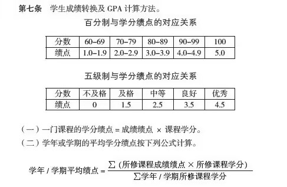

# XSYU GPA

Python 写的 西安石油大学(XSYU)绩点计算器

## 使用公式

## 演示
<video src="https://github.com/duzhaokun123/XSYU_GPA.py/raw/main/a.webm" controls="controls" width="100%" height="auto"></video>

## thanks

[PyInstaller](https://pyinstaller.org/)

[Requests](https://requests.readthedocs.io/)

[lxml](https://lxml.de/)

[prettytable](https://github.com/jazzband/prettytable)

[xsyu_electives_script](https://github.com/OhYesYesYes/xsyu_electives_script)